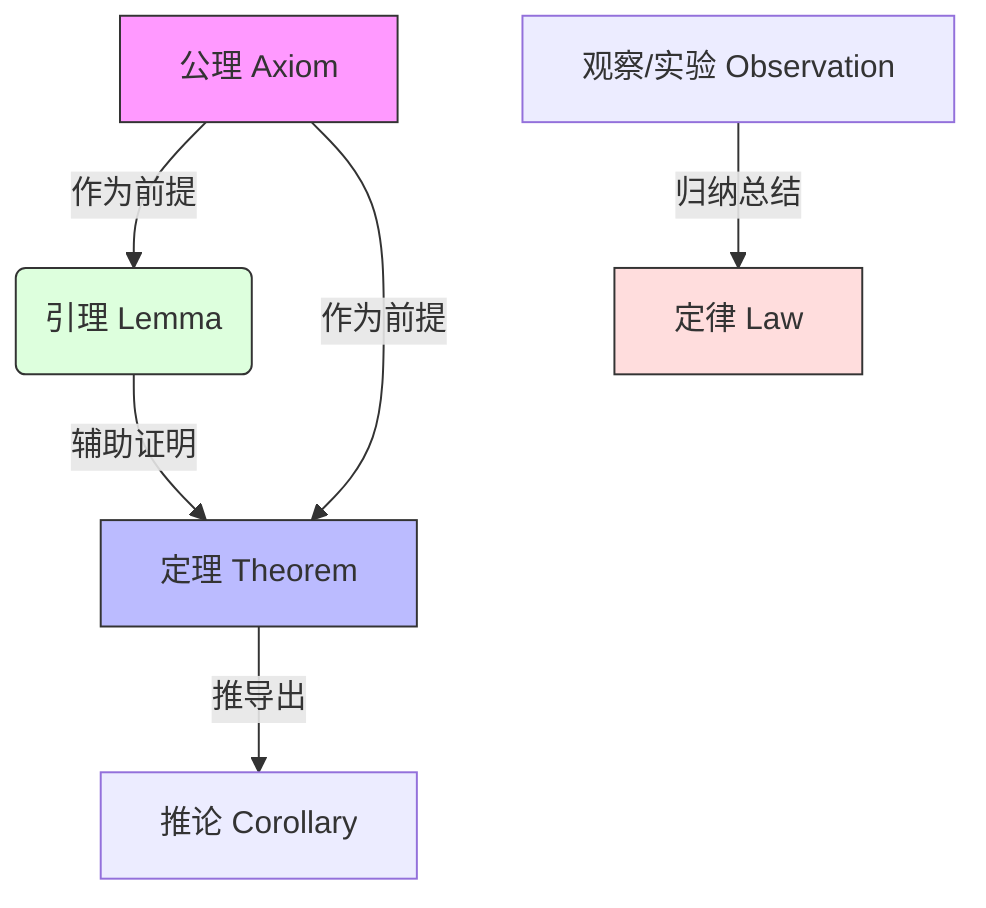
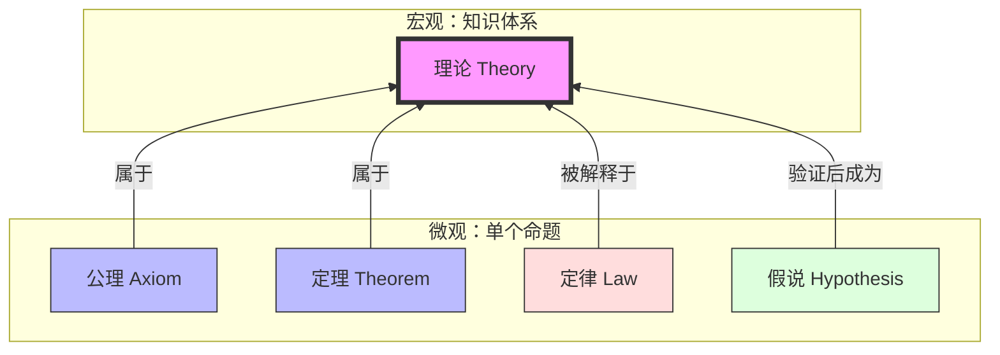

婚姻是爱情的坟墓，家庭是婚姻的坟墓。我不想进入任何一件这种事情，消磨我的激情。

对话是智慧的来源，语言是对话的媒介，因此语言是思维的壳子。中国没有诞生科学，就是不允许平等的话语权。

学习一些共识的时候，使用不同方法进行表示的时候，譬如真值表、特异性符号和逻辑符号表达式，可以将其与实际过程以及它们之间建立联想和等价联系。

不同的表达方式，有着不同的等价转换关系。

在学术体系（尤其是数学、逻辑学和自然科学）中，**公理、定理、引理、定律**构成了知识大厦的**逻辑链条**。它们之间的关系可以理解为“地基、砖块、脚手架与建筑规则”的关系。

以下是它们在逻辑层级、证明来源和适用范围上的详细对比与意义解析：

---

## 🏗️ 核心逻辑关系图谱

---

## 1. 公理 (Axiom / Postulate)
* **定位**：**逻辑的起点**，无需证明的“真理”。
* **相对于其他的意义**：
  - 它是定理、引理的**前提**。没有公理，后续所有推导都无法开始。
  - 它是系统内的“游戏规则”，在系统内默认为真。
* **特征**：
  - **自明性**：直观上被认为是不言自明的（如“两点之间直线最短”）。
  - **独立性**：不能由系统内其他公理推导出来。
  - **无证明**：不接受证明，只接受“接受”或“拒绝”（若拒绝，则进入另一套几何体系，如非欧几何）。
* **示例**：
  - 欧几里得几何五大公设。
  - 皮亚诺算术公理（定义自然数）。
  - 集合论中的 ZFC 公理系统。

## 2. 定理 (Theorem)
* **定位**：**逻辑的终点**，经过严格证明的重要结论。
* **相对于公理的意义**：
  - 它是公理的**衍生品**。定理的真理性依赖于公理和逻辑规则。
  - 它是知识体系的**核心成果**，具有普遍性和重要性。
* **特征**：
  - **可证明**：必须通过逻辑演绎从公理或其他定理推导出来。
  - **重要性**：通常指该领域内具有里程碑意义的结论。
* **示例**：
  - 勾股定理（Pythagorean Theorem）。
  - 费马大定理（Fermat's Last Theorem）。
  - 哥德尔不完备定理。

## 3. 引理 (Lemma)
* **定位**：**逻辑的垫脚石**，为证明定理服务的“小定理”。
* **相对于定理的意义**：
  - 它是**工具性**的。证明引理本身不是目的，用它证明更大的定理才是目的。
  - 界限模糊：一个重要的引理（如 Zorn's Lemma）可能比普通定理更有名。
* **特征**：
  - **中间步骤**：在长证明过程中，为了逻辑清晰，将中间结论单独提炼出来。
  - **技术性**：往往包含复杂的技术细节，为了不让主定理的证明显得臃肿而分离出来。
* **示例**：
  - 佐恩引理（Zorn's Lemma，用于证明存在性）。
  - 法图引理（Fatou's Lemma，实分析中的关键工具）。

## 4. 定律 (Law)
* **定位**：**经验的总结**（自然科学）或 **命名的习惯**（数学）。
* **相对于公理/定理的特殊性**：
  - **在数学中**：定律通常是**历史遗留命名**的定理或公理，本质上仍是逻辑推导结果。
    - 例：交换律（Commutative Law）在代数结构中可能是公理，也可能是定理。
    - 例：大数定律（Law of Large Numbers）其实是概率论中的**定理**。
  - **在自然科学（物理/化学）中**：定律是**基于观察的归纳**，而非纯逻辑推导。
    - 它描述“自然界是如何运作的”，而非“逻辑上必须如此”。
    - 它可能被修正或推翻（如牛顿定律被相对论修正）。
* **特征**：
  - **实证性**（科学）：基于实验数据，而非纯逻辑。
  - **描述性**：描述现象间的恒定关系。
* **示例**：
  - 牛顿万有引力定律（物理，可被修正）。
  - 热力学第二定律（物理，统计规律）。
  - 正弦定理（数学，实为几何定理）。

---

## 📊 四者核心区别对比表

| 维度 | **公理 (Axiom)** | **定理 (Theorem)** | **引理 (Lemma)** | **定律 (Law)** |
| :--- | :--- | :--- | :--- | :--- |
| **真理性来源** | **假设** (Assumed) | **证明** (Proven) | **证明** (Proven) | **观察/归纳** (Observed) 或 命名习惯 |
| **逻辑地位** | 起点/地基 | 核心结论/建筑主体 | 辅助工具/脚手架 | 规律描述/规则名称 |
| **是否需要证明** | **否** | **是** | **是** | 科学：否 (实验验证) 数学：是 (实为定理) |
| **可推翻性** | 不可推翻 (只能换系统) | 不可推翻 (除非前提错) | 不可推翻 | **可修正** (科学定律随认知更新) |
| **主要领域** | 数学、逻辑学 | 数学、逻辑学 | 数学、逻辑学 | 物理、化学 (及数学命名) |
| **典型句式** | "我们假设..." | "我们可以证明..." | "为了证明 X，先证..." | "实验表明..." / "X 与 Y 成正比" |

---

## 💡 补充概念：推论 (Corollary)
在学术体系中，还有一个常见术语是 **推论**。
* **定义**：由定理直接推导出的、显而易见的结论。
* **意义**：它是定理的“副产品”，证明过程非常短，通常只需一两步。
* **关系**：公理 → 引理 → 定理 → **推论**。

---

## 🎯 形象类比：建造一座大楼

为了便于记忆，我们可以用**建造大楼**来类比：

1.  **公理 (Axiom)** = **地基与土地契约**
    *   你无法证明地为什么在这里，你只能接受它。如果地基变了（非欧几何），楼的样子就全变了。
2.  **引理 (Lemma)** = **脚手架与预制件**
    *   为了盖楼，你先造了一些临时结构或零件。楼盖好后，脚手架可能拆了，但盖楼过程中离不开它。
3.  **定理 (Theorem)** = **大楼主体**
    *   这是你最终要交付的成果，坚固、正式、经过验收（证明）。
4.  **定律 (Law)** = **物理法则 / 交通法规**
    *   **在科学中**：像“重力”，楼必须遵守重力定律，否则會塌（这是外部约束）。
    *   **在数学中**：像“大楼命名规则”，比如这栋楼叫“交换律大厦”，其实它也是楼（定理）的一种。

---

## 🧐 为什么区分它们很重要？

1.  **判断知识可靠性**：
    *   看到**定理**，你知道它是逻辑严密的。
    *   看到**定律**（科学），你知道它可能在未来被更精确的理论修正（如牛顿力学→相对论）。
    *   看到**公理**，你知道这是讨论的前提，如果不同意公理，后续讨论无效。
2.  **阅读文献策略**：
    *   读数学证明时，重点看**定理**的条件和结论，**引理**可略读（除非你是做相关研究）。
    *   读科学论文时，重点看**定律**的适用范围和边界条件。
3.  **学术写作规范**：
    *   不要把自己的假设称为“定律”。
    *   不要将未经严格证明的猜想称为“定理”（那是 Conjecture）。

> 📌 **一句话总结**：  
> **公理是“我不证自明”，定理是“我证故我在”，引理是“我助人为乐”，定律是“我看世界如此”（科学）或“大家习惯叫我这个”（数学）。**

这是一个非常关键的问题。**"Theory**（理论）

简单来说：
*   **公理、定理、引理、定律** 通常是**单个命题**或**规则**。
*   **理论** 是一个**完整的知识体系**，它**包含**了公理、定理、定律、定义和模型。

如果把知识体系比作一座**城市**：
*   **公理** 是地基。
*   **定理** 是建筑物。
*   **定律** 是交通规则。
*   **理论** 则是**整个城市规划图 + 建筑规范 + 运行逻辑的总和**。

以下是 "Theory" 在不同学科语境下的具体层级和意义：

---

## 🌍 1. 自然科学语境（物理、生物、化学等）

在科学哲学中，"Theory" 处于**最高解释层级**。大众常误以为“理论”是不确定的猜测（如“这只是个理论”），但在科学界恰恰相反。

### 📈 科学知识的金字塔
| 层级 | 术语 | 含义 | 问题指向 | 确定性 |
| :--- | :--- | :--- | :--- | :--- |
| **L1** | **Observation **(观察) | 看到现象 | 发生了什么？ | 事实 |
| **L2** | **Hypothesis **(假说) |  tentative 解释 | 可能是为什么？ | 低（待验证） |
| **L3** | **Law **(定律) | 描述现象规律 | **是什么** (What) | 高（描述性） |
| **L4** | **Theory **(理论) | 解释背后机制 | **为什么** (Why) | **最高**（系统性解释） |

### 💡 核心区别：Law vs. Theory
*   **定律 **(Law)：描述**现象**。例如：牛顿万有引力定律描述了物体之间如何吸引（公式），但没解释**为什么**会有引力。
*   **理论 **(Theory)：解释**机制**。例如：广义相对论（理论）解释了引力其实是时空弯曲。
*   **关系**：理论不会变成定律，定律也不会变成理论。它们是互补的。**理论是科学理解的终极形态**。

> ✅ **经典案例**：
> *   **进化论 **(Theory of Evolution)：不是“猜测”，而是经过海量证据支持的、解释物种如何变化的完整框架。
> *   **原子理论 **(Atomic Theory)：解释物质结构的体系。

---

## 📐 2. 数学与逻辑语境

在数学中，"Theory" 指的是一个**形式系统**（Formal System）。它不是单个结论，而是一整套逻辑架构。

### 🏗️ 理论的构成
一个数学理论通常包含：
1.  **语言**：定义符号和语法。
2.  **公理 **(Axioms)：系统的起点。
3.  **推理规则**：允许如何推导。
4.  **定理 **(Theorems)：从公理推导出的所有真命题的集合。

### 📚 示例
*   **集合论 **(Set Theory)：不是某一个定理，而是包含 ZFC 公理系统、所有集合相关定理的整个领域。
*   **群论 **(Group Theory)：研究“群”这一代数结构的完整体系。
*   **模型论 **(Model Theory)：研究数学结构本身性质的理论。

> 📌 **意义**：在数学中，说“这是一个 Theory"，意味着它是一个**自洽的、封闭的逻辑宇宙**。

---

## 🎓 3. 人文与社会科学语境

在社会学、经济学、文学等领域，"Theory" 指的是**分析框架**或**视角**。

*   **功能**：提供一套透镜，用来解释复杂的社会现象。
*   **特点**：不像自然科学那样有严格的“证明”，更强调解释力、批判性和适用范围。
*   **示例**：
    *   **博弈论 **(Game Theory)：分析决策行为的框架。
    *   **批判理论 **(Critical Theory)：反思社会文化的哲学框架。
    *   **弦理论 **(String Theory)：物理学中尚未完全证实，但数学上自洽的框架（介于假说与理论之间）。

---

## 🔄 4. "Theory" 与其他术语的层级关系图

---

## 📊 综合对比表：Theory 处于什么级别？

| 维度 | 术语 | 级别/粒度 | 核心功能 | 确定性/状态 |
| :--- | :--- | :--- | :--- | :--- |
| **逻辑单元** | **公理/定理/引理** | **微观** (点/线) | 构建逻辑链条 | 逻辑上绝对真 (数学) |
| **经验规律** | **定律 **(Law) | **中观** (面) | 描述自然规律 |  empirically 高 (科学) |
| **猜测** | **假说 **(Hypothesis) | **微观** (点) | 待验证的猜想 | 低 (待检验) |
| **知识体系** | **理论 **(Theory) | **宏观** (体) | **解释机制 + 整合知识** | **最高 **(科学/数学) |
| **日常用语** | **理论 **(Theory) | **模糊** | 个人想法 | 低 ("我只是说说") |

---

## 💡 常见误区澄清

### ❌ 误区 1：“理论成熟了就变成定律”
*   **真相**：不会。理论解释“为什么”，定律描述“是什么”。它们并行存在。
    *   例：广义相对论（理论）解释了引力，但牛顿引力定律（定律）仍在工程中广泛使用（因为在低速下足够精确）。

### ❌ 误区 2：“这只是一个理论（暗示不可信）”
*   **真相**：这是日常用语对科学术语的误用。在科学中，“理论”是**最可信**的知识形态。
    *   例：如果你说“进化论只是个理论”，科学家会认为你不懂科学方法论。这就好比说“这座大楼只是个建筑”一样无力。

### ❌ 误区 3：“理论是空的，实践才是实的”
*   **真相**：在学术体系中，理论是**高度抽象的实践指南**。没有理论指导的实践是盲目的（试错成本极高）。
    *   例：没有电磁理论，就不可能设计出现代电路。

---

## 🎯 总结：Theory 的级别定位

如果把人类知识比作一棵树：
*   **公理** 是树根（深埋地下，支撑一切）。
*   **定理/定律** 是树枝和果实（具体的成果）。
*   **假说** 是新长出的嫩芽（待观察）。
*   **理论 **(Theory) 则是 **整棵树的生长模型 + 树干 + 枝叶系统的总和**。

> 📌 **一句话定义**：  
> **Theory 是最高级别的知识封装形式。它不是单个砖块**（定理）

如果您是在写论文或构建知识体系，使用 "Theory" 一词通常意味着您正在提出或引用一个**系统性的解释框架**，而不仅仅是某个具体的结论。
